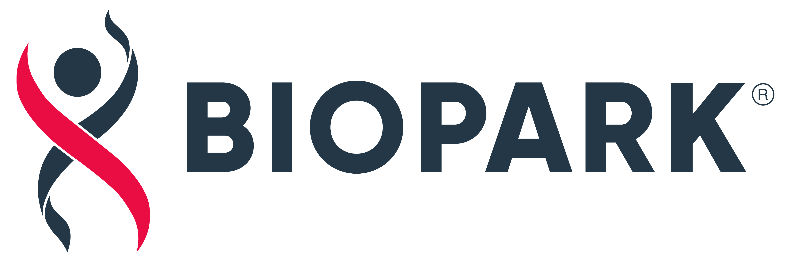

<h3 align="center">

</h3>
<h2 align="center">
  Projeto GDI
</h2>

## 🚀 Sobre

Frontend do projeto GDI

## 💻 Principais Tecnologias e Bibliotecas

- React 18.2 - (Biblioteca para construção de interfaces de usuário)
- Typescript 4.6 - (Linguagem de programação/Superconjunto tipagens Javascript)
- PrimeReact 8.6 - (Biblioteca de componentes de interface para React)
- Eslint 8.24 - (Ferramenta de análise de código)
- Prettier 2.7 - (Code Formatter)
- Vite 3.1
- Docker
- Docker Compose 3.9

## 🚀 Instalação e execução

1. Faça um clone desse repositório;
2. Entre na pasta do projeto pelo terminal;
3. Rode `yarn` para instalar as dependências;
4. Rode `yarn start` para abrir o projeto no navegador;

### Comandos Úteis

1. `yarn start` (Abre o projeto navegador (ambiente de desenvolvimento))
2. `yarn build` (Realiza o build (ambiente de produção))
3. `yarn lint` (Verifica erros do eslint)
4. `yarn lint:fix` (Corrige erros do eslint)
